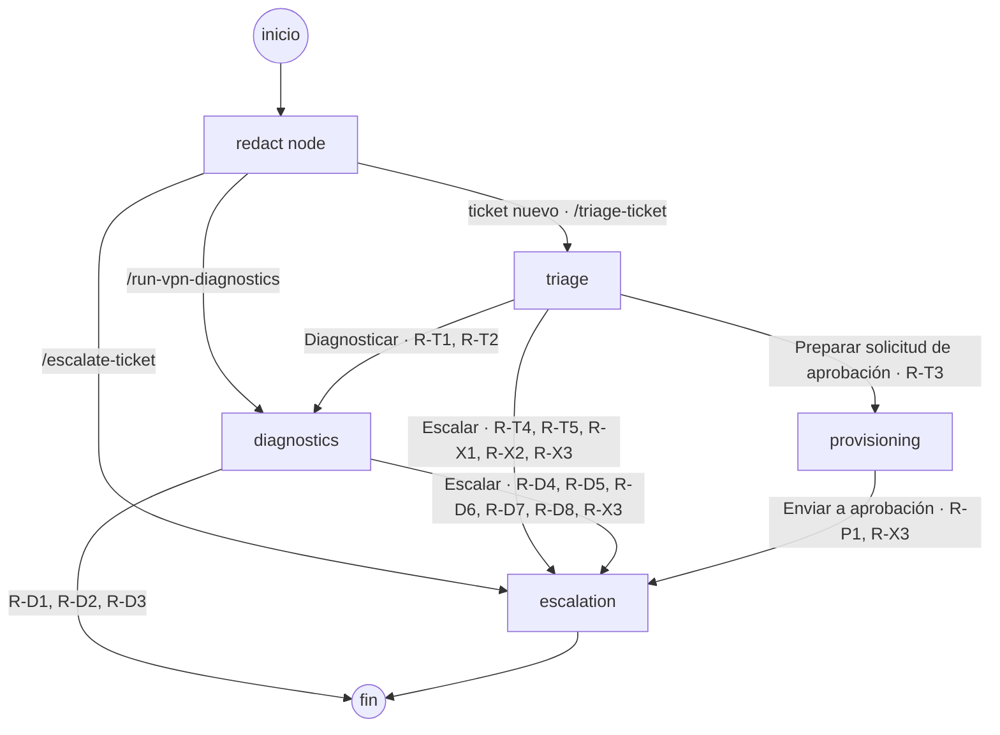

# Help Desk Agents

Ecosistema de agentes para una mesa de ayuda: clasifica incidencias escritas en lenguaje natural, diagnostica lo que se puede resolver de forma segura, prepara las solicitudes de acceso y escala el resto a una persona, con una bitácora auditable de cada decisión.

La especificación del producto vive en `.github/` y sigue el estándar de personalización de agentes de VS Code. Funciona en Copilot Chat tal cual, y además un runtime la **compila** en un grafo LangGraph expuesto por API, con una consola web para seguir cada ticket.

## Qué hay en `.github/`

Los cuatro componentes de la prueba:

| Componente | Archivo | Qué hace |
| --- | --- | --- |
| Custom Instructions | `.github/instructions/ticket-lifecycle.instructions.md` | Transiciones de estado permitidas, campos obligatorios por transición y definición verificable de «resuelto». `applyTo: "**/tickets/**"`. |
| Agent Skill | `.github/skills/vpn-diagnostics/` | Procedimiento paso a paso de diagnóstico de VPN con `scripts/check-vpn.js` (DNS, TCP y latencia, sin dependencias), timeout de 10 s y manejo de fallo con escalamiento `skill_resource_unavailable`. |
| Custom Agents y handoffs | `.github/agents/{triage,diagnostics,provisioning,escalation}.agent.md` | Cuatro agentes con herramientas mínimas y handoffs explícitos. El grafo es un DAG y `escalation` es terminal. |
| Prompt Files | `.github/prompts/{triage-ticket,run-vpn-diagnostics,escalate-ticket}.prompt.md` | Plantillas parametrizadas para que un operador dispare cada flujo bajo demanda. |

Las reglas globales (sin PII, sin jerga, en español) están en `.github/copilot-instructions.md`.

## Arquitectura

```
.github/  ──►  packages/agent-spec  ──►  apps/api (NestJS + LangGraph)  ──►  apps/web (Angular)
 spec           carga, valida y           un nodo por .agent.md,             bandeja, timeline
                compila la spec           API REST + SSE, bitácora JSONL     en vivo y bitácora
```

- **`packages/agent-spec`**: el «compilador». Lee los frontmatters y cuerpos de `.github/`, valida el DAG, las tools y las variables de los prompts (`pnpm spec:validate`) y define las reglas de enrutamiento (`src/routing.ts`), que se comprueban contra los handoffs declarados.
- **`apps/api`**: cada `.agent.md` es un nodo de un `StateGraph` y su cuerpo es el system prompt. Antes de cualquier llamada al LLM, un nodo `redact` quita correos, teléfonos, tokens y contraseñas. El LLM solo clasifica y redacta textos; el enrutamiento, las acciones y las transiciones son código determinista. Cada decisión queda en `data/audit/<ticketId>.jsonl`.
- **`apps/web`**: consola del operador con la bandeja de tickets, el detalle con el recorrido por el grafo (en vivo por SSE) y la bitácora.

### Grafo de agentes

Generado desde `.github/` con `pnpm spec:graph` (un test comprueba que este diagrama coincide con la spec):

<!-- SPEC:GRAPH:START -->

<!-- SPEC:GRAPH:END -->

Las etiquetas `R-xx` son las reglas de `packages/agent-spec/src/routing.ts` que toman cada camino.

## Requisitos

- Node.js de `.nvmrc` (22.23.3; el rango admitido está en `engines` y `pnpm install` falla fuera de él).
- pnpm 9 (`corepack enable`).

## Puesta en marcha

```bash
pnpm install
cp .env.example .env        # opcional: sin variables de LLM, el api usa el modelo determinista
pnpm spec:validate          # valida .github/ (frontmatters, DAG, tools, prompts, trazabilidad)
pnpm spec:graph             # imprime el grafo en Mermaid (--write actualiza este README)
pnpm test                   # todo el monorepo
pnpm lint                   # ESLint + Prettier
pnpm -F api dev             # http://localhost:3000
pnpm -F web start           # http://localhost:4200 (proxy /api → :3000)
node .github/skills/vpn-diagnostics/scripts/check-vpn.js --target vpn-gw.example.internal:443
```

### Proveedor del LLM

Se elige por variables de entorno, en este orden (el primero completo gana):

| Proveedor | Variables | Notas |
| --- | --- | --- |
| Azure OpenAI | `AZURE_OPENAI_ENDPOINT`, `AZURE_OPENAI_API_KEY`, `AZURE_OPENAI_DEPLOYMENT` (`AZURE_OPENAI_API_VERSION` opcional) | `AzureChatOpenAI` |
| DeepSeek | `DEEPSEEK_API_KEY` (`DEEPSEEK_MODEL`, por defecto `deepseek-chat`) | `ChatOpenAI` con la URL de DeepSeek |
| LM Studio | `LMSTUDIO_BASE_URL` (p. ej. `http://localhost:1234/v1`) y `LMSTUDIO_MODEL` | `ChatOpenAI` contra el servidor local |
| Fake | ninguna | Modelo determinista: la demo arranca sin secretos |

Los tests usan siempre el modelo fake (`NODE_ENV=test`). `GET /health` informa qué proveedor está activo. Nunca se guarda una clave en el repositorio: van en `.env`, que está en `.gitignore`.

## API

| Método | Ruta | Qué hace |
| --- | --- | --- |
| `POST` | `/tickets` | Crea un ticket (`{ text, channel }`) y arranca el grafo en triage. `202 { ticketId }` |
| `POST` | `/prompts/:name/run` | Ejecuta un prompt file con sus variables desde el agente que declara |
| `GET` | `/tickets`, `/tickets/:id`, `/tickets/:id/audit` | Bandeja, detalle y bitácora |
| `GET` | `/tickets/:id/events` | SSE: cada entrada de la bitácora y `done { status }` al terminar |
| `POST` | `/tickets/:id/reply`, `/tickets/:id/close` | Respuesta del usuario (`WAITING_USER`) y cierre por el operador |
| `GET` | `/health` | Proveedor del LLM y estado de la spec |

## Guion de demo

1. **Copilot Chat.** Abre el repo en VS Code y ejecuta `/triage-ticket` con el ticket «Desde esta mañana la VPN no me conecta desde casa. Mi correo es ana@example.com», canal `portal`. El agente triage clasifica `infra/vpn`, guarda el ticket en `data/tickets/` con el correo redactado y ofrece el handoff **Diagnosticar**.
2. **Skill.** Pulsa **Diagnosticar** o ejecuta `/run-vpn-diagnostics` con el `ticketId` y `target=vpn-gw.example.internal:443`. El agente carga `vpn-diagnostics`, ejecuta `check-vpn.js` y, si el gateway no responde, escala con el motivo del diagnóstico.
3. **Escalamiento.** Ejecuta `/escalate-ticket` sobre otro ticket: el agente escalation arma el paquete para el equipo que corresponde y deja la entrada en la bitácora.
4. **Runtime.** Arranca `pnpm -F api dev` y `pnpm -F web start`, abre http://localhost:4200 y crea un ticket nuevo desde **Nuevo ticket** con el mismo texto de VPN.
5. **Timeline en vivo.** El detalle del ticket muestra por SSE cada paso del grafo (redact → triage → diagnostics → …) con su duración, las derivaciones y los cambios de estado.
6. **Bitácora.** En la pestaña de bitácora, cada decisión tiene agente, motivo y regla; el correo aparece como `[EMAIL]` y el usuario como un `userRef` opaco (`usr_…`).
7. **Otro camino.** Crea «Necesito acceso de lectura a la carpeta compartida finanzas-2026»: provisioning estructura la solicitud y la envía a aprobación (`ESCALATED` con `approval_required`), sin conceder nada.
8. **Salud.** `curl http://localhost:3000/health` muestra el proveedor del LLM y que la spec es válida.

## Spec Driven Development

Este repo se construyó con Claude Code siguiendo `CLAUDE.md` (el contrato de trabajo) y `specs/`:

- `specs/requirements.md`: requisitos en EARS, con prioridad `MUST`/`SHOULD` y cómo se verifica cada uno.
- `specs/design.md`: arquitectura, máquina de estados, contratos y ADRs.
- `specs/tasks.md`: tareas con su criterio de hecho y su comando de verificación, y la tabla de trazabilidad requisito → tareas.
- `specs/changelog.md`: una línea por tarea terminada con lo que se verificó.

Cada fase se cerró solo con la aprobación explícita del humano (`aprobado fase N`). Las decisiones tomadas por delegación están en `docs/decisiones-para-revisar.md` y las pruebas manuales en Copilot Chat y el E2E con un LLM local, en `docs/manual-tests.md`.

## CI

`azure-pipelines.yml` ejecuta en Azure DevOps la validación de la spec, el lint y los tests del monorepo.
