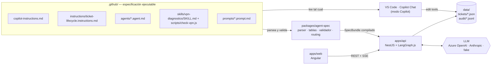
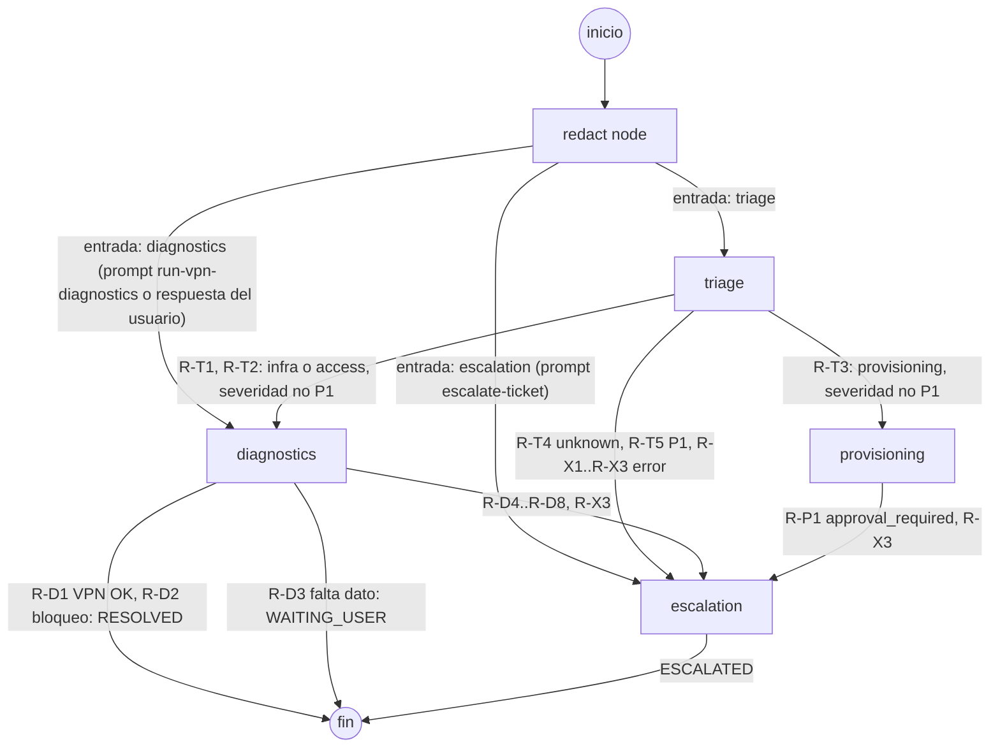
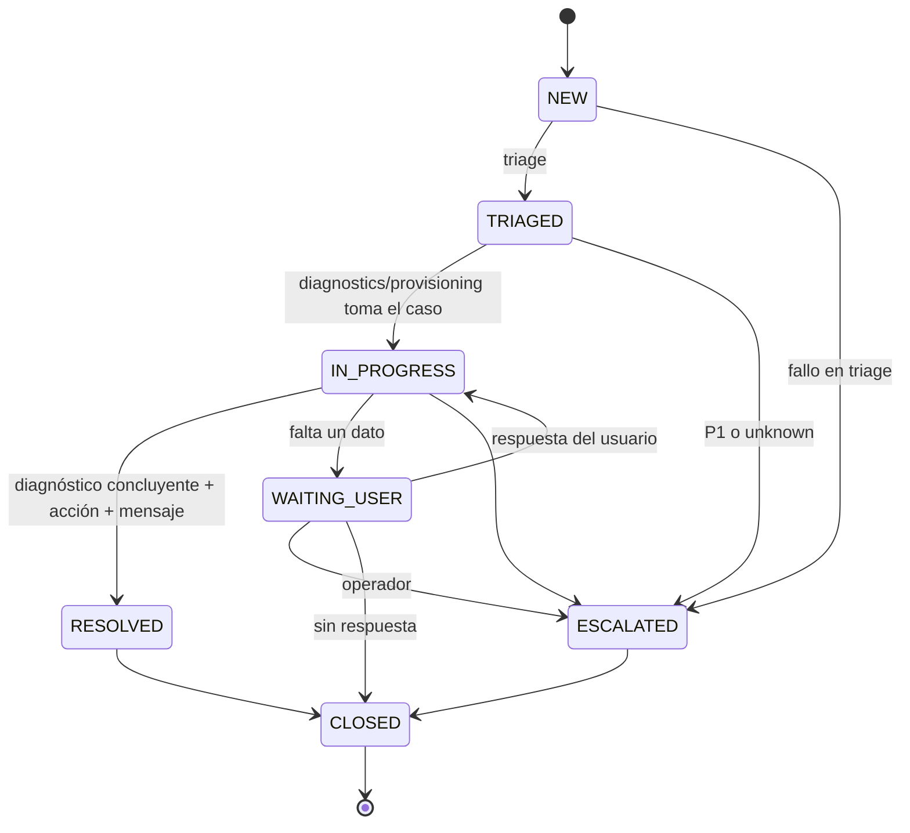

# Diseño — Ecosistema de Agentes Help Desk

> **Fase 0 · v0.3 · 2026-09-23 · Estado: aprobado 2026-09-23 (`aprobado fase 0`)** (v0.2: revisión con 5 puntos bloqueantes; v0.3: revisión de `tasks.md`. Ver §15)
> Implementa `specs/requirements.md` v0.4. Cada sección cita los `REQ` que satisface.
> Principio rector: **`.github/` es la especificación ejecutable**. VS Code la usa tal cual y el runtime la compila; ninguna regla se escribe a mano en dos sitios.
> **Excepción deliberada, los permisos:** `packages/agent-spec/src/policy.ts` es la **fuente normativa** de lo que cada agente puede declarar (visibilidad, handoffs permitidos, tools permitidas, campos de contexto de handoff, etiquetas prohibidas en la allowlist, nombres del registry). Es la guarda contra lo que declaran los `.md`, y por eso vive fuera de ellos. Las tablas de este documento (§5.2) y los Anexos B de `requirements.md` la **citan**; si difieren, gana `policy.ts` y el cambio necesita aprobación.

---

## 1. Arquitectura



**Dos modos de ejecución, una sola spec**

| | Modo Copilot (Fase 1, lo que se califica) | Modo runtime (Fases 2–4, plus) |
| --- | --- | --- |
| Quién ejecuta | Copilot Chat con los agentes, skills y prompts de `.github/` | Grafo LangGraph compilado desde `.github/` |
| Quién decide el enrutamiento | El LLM, siguiendo el cuerpo del `.agent.md`, y el operador al pulsar el botón de handoff | `routing.ts`, de forma determinista (ADR-02) |
| Redacción de PII | El agente `triage`, siguiendo instrucciones (mejor esfuerzo, R-03) | El redact node, determinista (§8) |
| Persistencia | El agente escribe `data/tickets/*.json` y `data/audit/*.jsonl` con las tools `edit` (ADR-06) | El runtime escribe los mismos archivos |
| Ciclo de vida | `applyTo: "**/tickets/**"` inyecta las reglas al editar un ticket | La máquina de estados se compila desde la misma tabla |

---

## 2. Grafo de agentes

Satisface: REQ-2.3-03..07, 2.3-12..17, 2.3-21..30, 2.3-36, ESC-03.



- **Nodos:** `redact` (función, no es agente) + un nodo por `.agent.md`.
- **Edges de agente a agente:** exactamente los `handoffs` declarados. El grafo es un DAG y `escalation` es terminal.
- **Edges de entrada** (`redact → agente`): no son handoffs. Los elige `state.entryAgent`, que fija la API: `triage` para tickets nuevos, y el `agent` del prompt file en los prompt runs.
- **Fin de un recorrido:** `RESOLVED`, `WAITING_USER` o `ESCALATED`. `CLOSED` solo se alcanza por la API (operador).

### 2.1 Reglas de enrutamiento (`packages/agent-spec/src/routing.ts`)

Cada agente produce una **entrada de enrutamiento** tipada y finita. `routing.ts` la convierte en un destino. El validador enumera todo el dominio de cada entrada y exige que se cumpla exactamente una regla (REQ-2.3-16), y que cada destino de agente exista como handoff declarado (REQ-2.3-15).

| ID | Desde | Entrada | Destino | Motivo | REQ |
| --- | --- | --- | --- | --- | --- |
| R-T1 | triage | `ok` · `category=infra` · `severity≠P1` | diagnostics | — | 2.3-21 |
| R-T2 | triage | `ok` · `category=access` · `severity≠P1` | diagnostics | — | 2.3-22 |
| R-T3 | triage | `ok` · `category=provisioning` · `severity≠P1` | provisioning | — | 2.3-23 |
| R-T4 | triage | `ok` · `category=unknown` · `severity≠P1` | escalation | `unknown_category` | 2.3-24 |
| R-T5 | triage | `ok` · `severity=P1` | escalation | `critical_severity` | 2.3-25 |
| R-D1 | diagnostics | `outcome=vpn_ok` | fin (`RESOLVED`) | — | 2.2-28 |
| R-D2 | diagnostics | `outcome=lockout_instructed` | fin (`RESOLVED`) | — | 2.3-27 |
| R-D3 | diagnostics | `outcome=needs_user_input` | fin (`WAITING_USER`) | — | 2.3-30 |
| R-D4 | diagnostics | `outcome=vpn_unhealthy` | escalation | `vpn_gateway_unhealthy` | 2.2-29 |
| R-D5 | diagnostics | `outcome=resource_unavailable` | escalation | `skill_resource_unavailable` | 2.2-25 |
| R-D6 | diagnostics | `outcome=identity_action` | escalation | `requires_identity_action` | 2.3-28 |
| R-D7 | diagnostics | `outcome=no_skill` | escalation | `no_diagnostic_skill` | 2.3-29 |
| R-D8 | diagnostics | `outcome=action_rejected` | escalation | `action_not_allowlisted` | 2.3-32 |
| R-P1 | provisioning | `ok` | escalation | `approval_required` | 2.3-36 |
| R-X1 | triage | `error=llm_unavailable` | escalation | `llm_unavailable` | ESC-04 |
| R-X2 | triage | `error=invalid_llm_output` | escalation | `invalid_llm_output` | ESC-05 |
| R-X3 | triage, diagnostics, provisioning | `error=internal` | escalation | `internal_error` | ESC-08 |

```ts
type TriageRouteInput =
  | { kind: 'ok'; category: Category; severity: Severity }            // 4 × 4 = 16 casos
  | { kind: 'error'; error: 'llm_unavailable' | 'invalid_llm_output' | 'internal' }; // 3 casos
type DiagnosticsRouteInput =
  | { kind: 'outcome'; outcome: DiagnosticsOutcome }                    // 8 casos
  | { kind: 'error'; error: 'internal' };                              // 1 caso
type ProvisioningRouteInput = { kind: 'ok' } | { kind: 'error'; error: 'internal' };

interface RouteRule<I> { id: string; from: AgentName; when: (i: I) => boolean; to: AgentName | 'END'; reason?: EscalationReason }
```

### 2.2 Procedimiento determinista de `diagnostics` → `DiagnosticsOutcome`

| Categoría | `entities.issueType` | Procedimiento | Outcome |
| --- | --- | --- | --- |
| cualquiera | — (prompt run con `target`) | skill `vpn-diagnostics` sobre `target` | como la fila de `vpn` |
| `infra` | `vpn` | skill `vpn-diagnostics` sobre `VPN_GATEWAY_TARGET`. Exit 0 → acción `instruct_vpn_reconnect` | `vpn_ok` · exit 1 → `vpn_unhealthy` · exit 2/timeout/JSON inválido → `resource_unavailable` |
| `infra` | `performance`, `app` | ninguno | `no_skill` |
| `access` | `lockout` | hallazgo por regla (`source: 'rule'`) + acción `instruct_self_service_unlock` | `lockout_instructed` |
| `access` | `password_reset`, `mfa`, `disabled_account` | ninguno (toca identidad) | `identity_action` |
| `infra`, `access` | `unknown` | pide el dato al usuario | `needs_user_input` |
| otra combinación | — | ninguno | `no_skill` |

Si el runtime rechaza una acción (no está en la allowlist o el ticket está `ESCALATED`), el outcome pasa a `action_rejected`.

---

## 3. Ciclo de vida del ticket

Satisface: REQ-2.1-01..14, COM-01. La tabla vive en `ticket-lifecycle.instructions.md` bajo el encabezado exacto `## Tabla de transiciones`. El runtime la compila (REQ-2.1-04) y Copilot la lee cuando edita `**/tickets/**`.



### 3.1 Tabla de transiciones (contenido normativo que se copiará al `.instructions.md`)

| # | desde | hacia | campos obligatorios | responsable |
| --- | --- | --- | --- | --- |
| T1 | `NEW` | `TRIAGED` | `category`, `severity`, `entities.userRef`, `entities.issueType` | triage |
| T2 | `NEW` | `ESCALATED` | `escalation.reason`, `userMessage` | escalation |
| T3 | `TRIAGED` | `IN_PROGRESS` | `nextAgent` | diagnostics / provisioning |
| T4 | `TRIAGED` | `ESCALATED` | `escalation.reason`, `userMessage` | escalation |
| T5 | `IN_PROGRESS` | `RESOLVED` | `findings[conclusive]`, `actions[allowlisted]`, `userMessage` | diagnostics |
| T6 | `IN_PROGRESS` | `WAITING_USER` | `userMessage` | diagnostics |
| T7 | `IN_PROGRESS` | `ESCALATED` | `escalation.reason`, `userMessage` | escalation |
| T8 | `WAITING_USER` | `IN_PROGRESS` | `entities.issueType!=unknown` | runtime (respuesta del usuario) |
| T9 | `WAITING_USER` | `ESCALATED` | `escalation.reason`, `userMessage` | escalation |
| T10 | `WAITING_USER` | `CLOSED` | `closeReason` | runtime (operador) |
| T11 | `RESOLVED` | `CLOSED` | `closeReason` | runtime (operador) |
| T12 | `ESCALATED` | `CLOSED` | `closeReason` | runtime (operador) |

- Las columnas `#` y `responsable` son informativas. El validador exige `desde`, `hacia` y `campos obligatorios` (REQ-2.1-02).
- **Predicados de "campos obligatorios"** (separados por comas):
  - `ruta.al.campo`: definido y no vacío (string ≠ `''`, array con elementos).
  - `ruta!=valor`: definido y distinto de `valor`.
  - `lista[flag]`: al menos un elemento con `flag === true`.
  - Si una ruta no existe en `TicketState`, el validador reporta `LIFECYCLE_TABLE_INVALID`.
- **Errores:** toda transición ausente → `INVALID_TRANSITION`. Si faltan campos: `RESOLUTION_INCOMPLETE` cuando el destino es `RESOLVED`, y `MISSING_REQUIRED_FIELDS` en los demás casos.
- **Definición de resuelto** (T5 + REQ-AUD-03): hallazgo concluyente + acción de la allowlist (incluye instrucción entregada) + `userMessage` + entrada de bitácora de la transición, que el runtime escribe de forma atómica con el cambio de estado.
- **Remediación en `ESCALATED`:** el servicio de acciones consulta el estado antes de ejecutar y rechaza con `ACTION_NOT_ALLOWLISTED` (REQ-2.1-11).

### 3.2 SLA (encabezado `## SLA` del mismo archivo)

| severidad | objetivo de resolución |
| --- | --- |
| P1 | 4 h |
| P2 | 8 h |
| P3 | 24 h |
| P4 | 72 h |

`slaDueAt = createdAt + objetivo` (REQ-2.1-14).

---

## 4. Contratos de datos

Satisface: CLAUDE.md §3.3 (refinado), REQ-AUD-02..05, ESC-01, ESC-09, 2.3-35.

```ts
type TicketStatus = 'NEW' | 'TRIAGED' | 'IN_PROGRESS' | 'WAITING_USER' | 'RESOLVED' | 'ESCALATED' | 'CLOSED';
type Category = 'access' | 'infra' | 'provisioning' | 'unknown';
type Severity = 'P1' | 'P2' | 'P3' | 'P4';
type Level = 'low' | 'medium' | 'high';
type AgentName = 'triage' | 'diagnostics' | 'provisioning' | 'escalation';
type Channel = 'email' | 'chat' | 'portal' | 'phone';

type IssueType =
  | 'lockout' | 'password_reset' | 'mfa' | 'disabled_account'          // access
  | 'vpn' | 'performance' | 'app'                                        // infra
  | 'folder_access' | 'repo_access' | 'license' | 'profile_change'      // provisioning
  | 'unknown';

interface Entities {
  userRef: string;                 // usr_<8 hex>; lo fija el redact node (SEC-05)
  service?: string;                // servicio afectado, ya redactado ("VPN corporativa")
  issueType: IssueType;            // D-07 / ADR-07
  businessImpact: Level;
  request?: {                      // solo provisioning: lo extrae triage y lo normaliza provisioning
    resource: string;
    accessLevel: 'read' | 'write' | 'admin' | 'license';
    justification: string;         // ya redactada
  };
}

interface DiagnosticFinding {
  id: string;                      // fnd_<n>
  source: 'check-vpn' | 'rule';
  conclusive: boolean;             // D-01
  cause?: 'gateway_healthy' | 'dns_failure' | 'gateway_unreachable' | 'high_latency'
        | 'account_locked_by_retries' | 'resource_unavailable';
  checks?: Array<{ name: 'dns' | 'tcp' | 'latency'; status: 'pass' | 'fail' | 'skip'; durationMs: number; reason?: string }>;
  exitCode?: 0 | 1 | 2 | null;     // null = matado por timeout
  summary: string;                 // técnico, interno; nunca va al usuario
  durationMs: number;
  ts: string;                      // ISO 8601
}

interface ExecutedAction {
  id: 'instruct_vpn_reconnect' | 'instruct_self_service_unlock';
  kind: 'instruction' | 'automated';
  allowlisted: true;               // solo lo fija el servicio de acciones tras validar
  agent: AgentName;
  result: 'delivered' | 'succeeded' | 'failed';
  ts: string;
}

type EscalationReason =
  | 'critical_severity' | 'unknown_category' | 'skill_resource_unavailable' | 'vpn_gateway_unhealthy'
  | 'requires_identity_action' | 'no_diagnostic_skill' | 'action_not_allowlisted' | 'approval_required'
  | 'llm_unavailable' | 'invalid_llm_output' | 'internal_error' | 'operator_request';

// Derivado por escalation desde entities.request + entities.userRef, que viajan en el handoff (REQ-ESC-09).
// summary = plantilla internal.approval. No existe en TicketState: solo dentro de EscalationPackage.
interface ApprovalRequest { resource: string; accessLevel: string; requesterRef: string; justification: string; complete: boolean; summary: string }

interface EscalationPackage {
  ticketId: string; category: Category; severity?: Severity; entities?: Entities;
  findings: DiagnosticFinding[]; reason: EscalationReason;
  targetTeam?: string;             // ESC-07
  approvalRequest?: ApprovalRequest;
  summary: string;                 // para el equipo humano (LLM o plantilla)
  createdAt: string;
}

interface AuditEntry {
  ts: string;
  ticketId: string;
  seq: number;                     // monótono por ticket
  agent: AgentName | 'redact' | 'runtime' | 'operator';
  decision: AuditDecision;
  reason: string;
  from?: string;                   // estado (transition) o agente (routed)
  to?: string;
  data?: Record<string, unknown>;  // ids, códigos, duraciones, conteos; nunca texto del ticket
}
type AuditDecision =
  | 'ticket_created' | 'redacted' | 'prompt_run' | 'node_started' | 'node_finished'
  | 'classified' | 'routed' | 'transition' | 'transition_rejected' | 'tool_run'
  | 'skill_resource_unavailable' | 'action_executed' | 'action_rejected'
  | 'message_replaced' | 'escalated' | 'llm_unavailable' | 'invalid_llm_output' | 'error';

interface RouteDecision { from: AgentName | 'redact'; to: AgentName | 'END'; rule: string; reason?: EscalationReason }

interface TicketState {
  ticketId: string;                // TCK-YYYYMMDD-HHMMSS-xxx (xxx = 3 base36)
  channel: Channel;
  createdAt: string;
  redactedText: string;            // lo único del texto que existe en el estado
  category?: Category;
  severity?: Severity;
  urgency?: Level;                 // entrada de la matriz de severidad
  entities?: Entities;
  findings: DiagnosticFinding[];   // reducer: append
  actions: ExecutedAction[];       // reducer: append
  status: TicketStatus;
  audit: AuditEntry[];             // reducer: append; fuente persistida = JSONL
  entryAgent: AgentName;           // lo fija la API
  nextAgent?: 'diagnostics' | 'provisioning' | 'escalation';
  lastRoute?: RouteDecision;
  escalation?: EscalationPackage;
  userMessage?: string;
  slaDueAt?: string;
  closeReason?: 'user_confirmed' | 'no_user_reply' | 'handled_by_team';
}
```

**Contexto de handoff** (REQ-2.3-17): el nodo destino recibe un `HandoffEnvelope`:

```ts
interface HandoffEnvelope {
  context: Pick<TicketState, 'ticketId' | 'category' | 'severity' | 'entities' | 'findings'>;
  route: RouteDecision;            // metadatos del enrutamiento (incluye reason), no contenido del ticket
  prompt: string;                  // handoffs[].prompt del .agent.md de origen
}
```

`reason` viaja como metadato de la ruta, no como contexto del ticket. Así el escalamiento sabe por qué llega sin ampliar el contexto fijado en CLAUDE.md §2.3. La misma decisión queda en la entrada `routed` de la bitácora.

---

## 5. Agentes

Satisface: REQ-2.3-01..11, 2.3-18..36, ESC-01..08.

### 5.1 Qué hace el LLM y qué hace el código (ADR-05)

| Nodo | El LLM decide | El LLM redacta | Sin LLM |
| --- | --- | --- | --- |
| triage | `category`, `issueType`, `service`, `businessImpact`, `urgency`, `request` (salida estructurada zod) | — | R-X1 → escalation `llm_unavailable` |
| diagnostics | nada | `userMessage` a partir de la plantilla de la acción | plantilla (COM-06) |
| provisioning | nada | nada: normaliza `entities.request` de forma determinista (REQ-2.3-35) | no aplica |
| escalation | nada | `escalation.summary`, `userMessage`. `approvalRequest` se deriva sin LLM (REQ-ESC-09), con `summary` de la plantilla `internal.approval` | plantilla (ESC-06, ESC-10, COM-06) |

`severity` no la elige el LLM: el runtime la calcula con la matriz (§5.3). El enrutamiento, las acciones y las transiciones son siempre código.

### 5.2 Tools por agente (cita de `policy.ts`, REQ-2.3-09)

Nombres exactos de la doc de VS Code. La fuente normativa es `packages/agent-spec/src/policy.ts`; esta tabla la cita. VS Code ignora sin avisar las tools que no reconoce, así que M-09 confirma, en la tarea que escribe cada agente, que los nombres calificados se resuelven en la versión instalada (R-06).

| Agente | `tools` | Para qué (modo Copilot) |
| --- | --- | --- |
| triage | `read/readFile`, `edit/createFile`, `edit/editFiles` | crear el ticket y añadir entradas a la bitácora |
| diagnostics | `read/readFile`, `edit/editFiles`, `execute/runInTerminal` | leer el ticket, ejecutar `check-vpn.js`, actualizar ticket y bitácora |
| provisioning | `read/readFile`, `edit/editFiles` | leer el ticket, escribir la solicitud de aprobación |
| escalation | `read/readFile`, `edit/editFiles` | leer el ticket, escribir el paquete de escalamiento |

Ningún agente tiene `web`, `agent`, `vscode` ni `browser`. `provisioning` no tiene `execute`: no puede conceder nada.

### 5.3 Matriz de severidad (`triage.agent.md`, encabezado `## Matriz de severidad`)

| impacto ↓ / urgencia → | high | medium | low |
| --- | --- | --- | --- |
| high | P1 | P2 | P3 |
| medium | P2 | P3 | P4 |
| low | P3 | P4 | P4 |

### 5.4 Handoffs declarados

Todos con `send: true`: al pulsar el botón, el prompt se envía sin otro paso. Los campos de contexto se nombran entre comillas invertidas, porque así los detecta el validador (REQ-2.3-11: todo token entre comillas invertidas que sea clave de `TicketState` debe estar en el conjunto permitido).

| Origen → destino | `label` | `prompt` |
| --- | --- | --- |
| triage → diagnostics | Diagnosticar | Diagnostica este ticket usando solo `ticketId`, `category`, `severity`, `entities` y `findings` del resumen de triage. No uses el texto original del usuario. |
| triage → provisioning | Preparar solicitud de aprobación | Prepara la solicitud de aprobación usando solo `ticketId`, `category`, `severity`, `entities` y `findings`. No concedas ningún acceso. |
| triage → escalation | Escalar | Escala este ticket usando solo `ticketId`, `category`, `severity`, `entities` y `findings`, e indica el motivo del enrutamiento. |
| diagnostics → escalation | Escalar | Escala este ticket usando solo `ticketId`, `category`, `severity`, `entities` y `findings`, e indica el motivo del enrutamiento. |
| provisioning → escalation | Enviar a aprobación | Envía la solicitud de aprobación a escalamiento usando solo `ticketId`, `category`, `severity`, `entities` y `findings`. |

En modo Copilot, el cuerpo de `triage.agent.md` obliga a cerrar cada respuesta con un bloque `Resumen de triage` (JSON con esos cinco campos) y a **recomendar un solo handoff** según §2.1 (REQ-2.3-26). VS Code conserva el historial al cambiar de agente (R-01); el aislamiento estricto es del runtime.

### 5.5 Allowlist de remediación (`diagnostics.agent.md`, encabezado `## Allowlist de remediación`)

| id | tipo | aplica a | etiquetas | descripción |
| --- | --- | --- | --- | --- |
| `instruct_vpn_reconnect` | instruction | infra/vpn | vpn-client | Indicar al usuario que cierre y vuelva a abrir el cliente VPN tras confirmar que el servicio central responde. |
| `instruct_self_service_unlock` | instruction | access/lockout | self-service | Indicar al usuario que espere 15 min o use el portal de autoservicio de desbloqueo. |

- **Etiquetas prohibidas:** `mfa`, `credentials`, `permissions` → `UNSAFE_ALLOWLIST_ACTION` (REQ-2.3-33).
- El runtime la compila al arrancar (REQ-2.3-34). Cualquier acción con un `id` fuera de la tabla → `ACTION_NOT_ALLOWLISTED` (REQ-2.3-31).
- En v1 no hay acciones `automated` sobre sistemas reales (fuera de alcance). El tipo queda para extender la tabla.

### 5.6 Equipos de escalamiento (`escalation.agent.md`, encabezado `## Equipos de escalamiento`, SHOULD)

| categoría | equipo |
| --- | --- |
| access | Identidad y Accesos |
| infra | Infraestructura y Redes |
| provisioning | Gestión de Accesos (aprobadores) |
| unknown | Mesa de Ayuda N2 |

---

## 6. Skill `vpn-diagnostics`

Satisface: REQ-2.2-01..30, SEC-15.

### 6.1 `SKILL.md`

- **Frontmatter:** `name: vpn-diagnostics` (igual que la carpeta) y `description` ≤ 1024 caracteres con qué hace + `Úsala cuando …` (conectividad VPN, no conecta, se cae, va lenta).
- **Cuerpo:**
  1. Procedimiento numerado: verificar que el ticket es `infra/vpn` → obtener el target → **validar el formato del target con `^[a-z0-9.-]+:\d{1,5}$`; si no cumple, no ejecutar nada y pedir un target válido** (REQ-SEC-15) → ejecutar [`scripts/check-vpn.js`](./scripts/check-vpn.js) → interpretar el exit code → registrar el hallazgo → aplicar la acción o hacer handoff.
  2. Tabla de interpretación de exit codes (0/1/2). **Antes de mirar el exit code**, el agente comprueba que stdout es un JSON válido con `ok`, `checks` y `summary`. Si no lo es, el resultado es `skill_resource_unavailable` sea cual sea el exit code. Caso típico: si falta el script, Node sale con exit `1` sin JSON, y sin esta regla se leería como `vpn_gateway_unhealthy` (REQ-2.2-30).
  3. `## Manejo de fallos` con la línea parseable `- **Timeout:** 10 s`. Detalla qué registrar en bitácora (`skill_resource_unavailable`, exit code, duración), la regla de salida no JSON del punto 2 y el handoff a `escalation`. M-04 lo prueba renombrando temporalmente el script, porque un target sin puerto lo rechaza antes la validación del paso 1 (SEC-15) y un host colgado da exit `1` dentro del plazo (DNS + TCP ≤ 6 s < 9 s).

### 6.2 `scripts/check-vpn.js`

- **Dependencias:** solo `node:dns`, `node:net`, `node:perf_hooks` (REQ-2.2-22). Sintaxis ESM, que funciona por la raíz `"type": "module"` y por la detección de módulos de Node LTS.
- **CLI:**

| Argumento | Obligatorio | Por defecto | Uso |
| --- | --- | --- | --- |
| `--target <host>:<port>` | sí | — | destino a comprobar |
| `--timeout-ms <n>` | no | 3000 | timeout por check (DNS y TCP) |
| `--latency-threshold-ms <n>` | no | 300 | umbral del check de latencia |
| `--deadline-ms <n>` | no | 9000 (`DEFAULT_DEADLINE_MS`, máx. 9000) | plazo total; solo se reduce en tests |

- **Secuencia:** `dns` (`dns.promises.lookup`) → `tcp` (`net.connect`, tiempo medido con `performance.now()`) → `latency` (compara con el umbral). Si falla `dns`, `tcp` y `latency` quedan en `skip`.
- **Salida** (una línea JSON en stdout, siempre las mismas claves):

```json
{
  "version": 1,
  "ok": false,
  "target": { "host": "vpn-gw.example.internal", "port": 443 },
  "checks": [
    { "name": "dns", "status": "fail", "durationMs": 12, "reason": "ENOTFOUND" },
    { "name": "tcp", "status": "skip", "durationMs": 0, "reason": "dns_failed" },
    { "name": "latency", "status": "skip", "durationMs": 0, "reason": "dns_failed" }
  ],
  "summary": "dns fail (ENOTFOUND) · tcp skip · latency skip",
  "error": null,
  "durationMs": 14
}
```

- **Exit codes:**
  - `0` → todos los checks `pass`.
  - `1` → al menos un `fail`; un timeout por check cuenta como `fail` con `reason: "timeout"`.
  - `2` → argumentos inválidos, error interno o plazo total superado. En ese caso `error: { code: "INVALID_ARGS" | "INTERNAL" | "DEADLINE_EXCEEDED", message }`, `ok: false` y `checks` con lo que alcanzó a correr.

### 6.3 Tool del runtime (`apps/api/src/tools/skill-runner.ts`)

- `spawn(process.execPath, [scriptPath, ...args])`. La ruta sale del enlace del `SKILL.md` y `timeoutMs` de la línea `Timeout` (ADR-01).
- **Sin carrera de timeouts:**
  - El script vence primero, a los 9 s (`DEFAULT_DEADLINE_MS`), y sale con exit `2` y `DEADLINE_EXCEEDED`. En bitácora queda `exitCode: 2`.
  - El runtime mata a los 10 s (`timeoutMs` del `SKILL.md`) con `SIGKILL`, solo si el script está bloqueado y no llegó a su propio plazo. En bitácora queda `exitCode: null` (REQ-2.2-24).
  - Ambos casos dan `resource_unavailable`, pero cada test ejerce uno solo de forma determinista: el de plazo usa `--deadline-ms` bajo; el de `SIGKILL` usa un script de fixture que bloquea el event loop.
- **Sin shell:** `spawn` recibe los argumentos como array, así que en el runtime el `target` no puede inyectar comandos. Además la api valida su formato (§7).
- stdout se parsea con zod. Si el JSON es inválido, cuenta como `resource_unavailable` (REQ-2.2-25).
- **Hallazgo** (REQ-2.2-27):
  - exit 0 → `conclusive: true`, `cause: gateway_healthy`.
  - exit 1 → `conclusive: true`, `cause` según el primer check fallido: `dns_failure`, `gateway_unreachable` o `high_latency`.
  - fallo → `conclusive: false`, `cause: resource_unavailable`.
- **Validador** (REQ-2.2-08): exige `DEFAULT_DEADLINE_MS` < `Timeout` del `SKILL.md`, leyendo `DEFAULT_DEADLINE_MS` del código fuente del script con una expresión regular. Si no → `SKILL_DEADLINE_INVALID`.
- **Modo Copilot:** el comando se ejecuta con `execute/runInTerminal` y `${input:target}` termina dentro de un comando de terminal. `VPN_ALLOWED_TARGETS` solo protege al runtime, así que hay dos defensas propias de este modo:
  1. **El agente valida el formato antes de ejecutar** (paso del `SKILL.md`, REQ-SEC-15). Con `x:1; rm -rf ~` no se ejecuta nada.
  2. **Auto-aprobación solo con una regex anclada**, nunca por prefijo. Si se activa `chat.tools.terminal.autoApprove`, la regla es:
     ```json
     "chat.tools.terminal.autoApprove": {
       "/^node \\.github\\/skills\\/vpn-diagnostics\\/scripts\\/check-vpn\\.js --target [a-z0-9.-]+:\\d{1,5}$/": true
     }
     ```
     Una regla por prefijo aprobaría también `… --target x:1; rm -rf ~`. Con la regex anclada, cualquier comando con más caracteres pide confirmación manual (R-05).
     **Decisión v1 (D-11): no se activa.** No hay `.vscode/settings.json`; el operador confirma cada ejecución, y esa confirmación es la guarda frente a la inyección de comandos en modo Copilot. La regla queda documentada por si se activa más adelante.

---

## 7. Prompt files

Satisface: REQ-2.4-01..15, SEC-06, SEC-14.

| Archivo | `agent` | `tools` | Variables | Referencias `#tool:` en el cuerpo |
| --- | --- | --- | --- | --- |
| `triage-ticket.prompt.md` | `triage` | `read/readFile`, `edit/createFile`, `edit/editFiles` | `${input:ticket}`, `${input:channel:email · chat · portal · phone}` | `#tool:edit/createFile` (ticket), `#tool:edit/editFiles` (bitácora) |
| `run-vpn-diagnostics.prompt.md` | `diagnostics` | `read/readFile`, `edit/editFiles`, `execute/runInTerminal` | `${input:ticketId}`, `${input:target:host:puerto}` | `#tool:read/readFile`, `#tool:execute/runInTerminal` |
| `escalate-ticket.prompt.md` | `escalation` | `read/readFile`, `edit/editFiles` | `${input:ticketId}`, `${input:reason}` | `#tool:read/readFile`, `#tool:edit/editFiles` |

**Ejecución en el runtime (`POST /prompts/:name/run`)**

1. Resolver `:name` → 404 si no existe (REQ-2.4-14).
2. Validar el body `{ variables: Record<string,string> }` contra las variables del template → 400 con las que falten (REQ-2.4-13).
3. Validar formatos:
   - `ticketId` con la regex estricta; si no existe → 404 (REQ-2.4-15).
   - `channel` dentro del enum.
   - `target` con el formato `^[a-z0-9.-]+:\d{1,5}$` (el mismo del `SKILL.md`) y presente en `VPN_ALLOWED_TARGETS` → si no, 400 (REQ-SEC-14).
   - Estado del ticket compatible con el prompt: `run-vpn-diagnostics` exige `TRIAGED`, `IN_PROGRESS` o `WAITING_USER`; `escalate-ticket` exige un estado con transición a `ESCALATED` en la tabla (`NEW`, `TRIAGED`, `IN_PROGRESS`, `WAITING_USER`). Si no → 409 `INVALID_TRANSITION`.
4. Arrancar el grafo con `entryAgent = frontmatter.agent`.
5. El **redact node** procesa las variables de texto libre (`ticket`, `reason`) y fija `userRef` (REQ-SEC-06).
6. El nodo de entrada **renderiza** el template con las variables ya redactadas (REQ-2.4-11) y lo usa como mensaje humano de su llamada al LLM. El primer agente que se ejecuta es el del `agent` del prompt (REQ-2.4-12).
7. Respuesta `202 { ticketId }`. El progreso llega por SSE.

`POST /tickets { text, channel }` es un alias de `POST /prompts/triage-ticket/run` (REQ-API-02/03).

---

## 8. PII y redacción

Satisface: REQ-SEC-01..13, AUD-06.

### 8.1 Patrones del redact node (`apps/api/src/redact/patterns.ts`, en este orden)

| # | Detecta | Reemplazo |
| --- | --- | --- |
| 1 | JWT `eyJ…\.…\.…` | `[TOKEN]` |
| 2 | `Bearer <token>`; prefijos `sk-`, `ghp_`, `xox[abp]-`, `AKIA…`; cadenas `[A-Za-z0-9_-]{32,}` | `[TOKEN]` |
| 3 | `(password\|passwd\|pwd\|contraseña\|contrasena\|clave\|pin\|secret\|token)\s*[:=]\s*\S+` y `(contraseña\|clave) es \S+` | `<palabra>: [SECRET]` |
| 4 | email | `[EMAIL]` |
| 5 | teléfono (≥ 8 dígitos con `+`, espacios, guiones o paréntesis) | `[PHONE]` |
| 6 | documento de identidad `(cédula\|cc\|dni)\s*:?\s*\d{6,}` | `[ID]` |
| 7 | `(usuario\|user\|login)\s*[:=]?\s*[a-z0-9._-]{3,}` | `<palabra>: [USER]` |

- **`userRef`** (SEC-05): se toma el primer email o, si no hay, el primer usuario del patrón 7. Se normaliza (minúsculas, trim) y `userRef = "usr_" + HMAC-SHA256(REDACTION_SALT, id).hex.slice(0, 8)`. Si no hay identificador, `usr_unknown`. Sin `REDACTION_SALT`, se genera una sal aleatoria por proceso y se avisa en el arranque: los `userRef` no serán estables entre reinicios.
- **Auditoría del redact node:** la entrada `redacted` lleva solo conteos por tipo (`{ EMAIL: 1, SECRET: 1 }`), nunca valores.
- **Persistencia** (SEC-07): el texto crudo solo existe en la petición HTTP en curso. `TicketState` no tiene campo para él.
- **Fallo del redact node:** el ticket se crea con `redactedText: ''` y va a `escalation` con `internal_error`. El texto crudo nunca se guarda.
- **Logger** (SEC-08): el serializer descarta las claves `text`, `ticket`, `redactedText`, `reason`, `variables` y `body`. Solo se registran ids, códigos y duraciones.
- **Bitácora** (SEC-09): antes de escribir, la entrada serializada pasa otra vez por los patrones 1–7.
- **Modo Copilot** (R-03): `triage` redacta siguiendo instrucciones y genera `userRef` como `usr_` + 8 hex aleatorios (no estable). Es mejor esfuerzo, y queda documentado como limitación.
- **Fixtures** (SEC-13): solo dominios `example.com` y `example.internal`.
- **Ruta de archivos:** la regex estricta de `ticketId` evita ataques de ruta (path traversal) en `data/`.

### 8.2 Guardas del `userMessage` (`apps/api/src/guards/user-message.guard.ts`)

Se aplican en orden a todo `userMessage` antes de la transición. Si alguna salta, se usa la plantilla del resultado y se escribe la entrada `message_replaced` con la regla.

1. Pide contraseña, token o código MFA → SEC-10. Regex (JS, flags `iu`):
   `(envía|comparte|indica|dime|escribe).{0,40}(contraseña|(?:tu|su|la|una)\s+clave|token|código(?!\s+del?\s+caso\b))`.
   - `clave` solo salta con un determinante delante (*dime tu clave*, *escribe la clave*). Se usa contexto positivo en lugar de excluir frases, porque con exclusiones siempre queda otra ("punto clave", "palabra clave").
   - El lookahead de `código` excluye "código del caso" y "código de caso", que son la referencia al ticket, no una credencial.
   - **Asimetría aceptada:** ante la duda, la guarda salta. Un falso positivo solo cambia el mensaje por la plantilla; un falso negativo filtra una petición de credenciales. Por eso *indica los códigos del caso* sigue saltando y la regex no se afina más.
   - Casos del test. No saltan: *indica el código del caso*, *indica el paso clave*. Saltan: *envía el código MFA*, *dime tu clave*, *escribe la clave*, *indica el código del caso y tu contraseña*, *indica los códigos del caso*.
2. Contiene términos de la lista de jerga → COM-02.
3. Contiene `usr_[0-9a-f]{8}` o un fragmento JSON (`{"`) → COM-04.
4. En `ESCALATED`, no contiene el `ticketId` → COM-03.

---

## 9. Comunicación

Satisface: REQ-COM-01..06. Todo vive en `.github/copilot-instructions.md`, que el runtime compila (ADR-01).

- **`## Lista de jerga`** (una por línea, sin distinguir mayúsculas, a nivel de palabra): DNS, TCP, gateway, latencia, puerto, dirección IP, timeout, exit code, stack trace, JSON, handoff, endpoint, hash, userRef. "VPN" está permitida porque el usuario la conoce.
- **`## Plantillas de mensaje`** (tabla `clave | texto`, con marcador `{ticketId}`):

| clave | texto |
| --- | --- |
| `resolved.instruct_vpn_reconnect` | Revisamos el servicio de conexión remota y está funcionando. Cierra por completo la aplicación de VPN, vuelve a abrirla e inicia sesión. Si el problema sigue, responde citando el caso {ticketId}. |
| `resolved.instruct_self_service_unlock` | Tu cuenta se bloqueó temporalmente por varios intentos fallidos. Espera 15 minutos o usa el portal de autoservicio para desbloquearla. Nunca compartas tu contraseña con nadie, tampoco con soporte. Caso {ticketId}. |
| `waiting_user` | Para ayudarte con el caso {ticketId} necesitamos un dato más: ¿qué falla? Elige una opción: conexión remota (VPN), lentitud del equipo o una aplicación. |
| `escalated` | Tu caso {ticketId} quedó asignado a un equipo especialista, que te contactará dentro del plazo de atención acordado. |
| `internal.summary` | Caso {ticketId} escalado. Consulta los hallazgos adjuntos. |
| `internal.approval` | Solicitud de acceso del caso {ticketId} pendiente de aprobación. |

- El fake model devuelve exactamente la plantilla, lo que deja los tests deterministas. Los tests de guardas usan un fake que devuelve texto con jerga o con una petición de contraseña.

---

## 10. Mapeo `.github/` → runtime

Satisface: CLAUDE.md §3.2, REQ-2.1-04, 2.2-08, 2.3-12..14, 2.3-34, 2.4-11..12, COM-02, VAL-01..03.

| Origen | Campo o sección | Alimenta en el runtime | Lo valida |
| --- | --- | --- | --- |
| `agents/*.agent.md` | nombre de archivo / `name` | id del nodo | VAL-01 |
| | `description` | etiqueta del nodo en `/health` y la web | 2.3-01 |
| | `tools` | resolución en el registry de tools | 2.3-09, 2.3-10 |
| | `handoffs[].agent` | edges permitidos del DAG | 2.3-03..07 |
| | `handoffs[].prompt` | `HandoffEnvelope.prompt` (mensaje humano del nodo destino) | 2.3-11 |
| | `handoffs[].label` | texto del handoff en el timeline | 2.3-02 |
| | `handoffs[].send` | solo UX de VS Code; el runtime lo ignora | 2.3-02 |
| | `user-invocable` | solo validación | 2.3-08 |
| | cuerpo | system prompt del nodo | 2.3-13 |
| | `## Matriz de severidad` (triage) | cálculo de `severity` | 2.3-19 |
| | `## Allowlist de remediación` (diagnostics) | servicio de acciones | 2.3-33, 2.3-34 |
| | `## Equipos de escalamiento` (escalation) | `targetTeam` | ESC-07 |
| `skills/vpn-diagnostics/SKILL.md` | `name`, `description` | catálogo de skills | 2.2-01..04 |
| | enlace a `scripts/check-vpn.js` | `scriptPath` de la tool | 2.2-06 |
| | `- **Timeout:** 10 s` | `timeoutMs` de la tool (el validador exige `DEFAULT_DEADLINE_MS` < timeout) | 2.2-07, 2.2-08 |
| `prompts/*.prompt.md` | `agent` | `entryAgent` | 2.4-02 |
| | `tools` | coherencia con las referencias `#tool:` | 2.4-01, 2.4-07 |
| | cuerpo | template renderizado; lista de `${input:*}` | 2.4-03..06 |
| `instructions/ticket-lifecycle.instructions.md` | `applyTo` | solo validación | 2.1-01 |
| | `## Tabla de transiciones` | máquina de estados | 2.1-02..04 |
| | `## SLA` | `slaDueAt` | 2.1-14 |
| `copilot-instructions.md` | `## Lista de jerga` | guarda COM-02 | — |
| | `## Plantillas de mensaje` | plantillas y fallbacks | — |

**Convención de tablas parseables:** el parser (`packages/agent-spec/src/tables.ts`, sin dependencias nuevas) busca el encabezado exacto y lee la primera tabla GFM que viene después. Si falta el encabezado o la tabla, reporta el error del dominio (p. ej. `LIFECYCLE_TABLE_INVALID`).

**Frontmatter:** `gray-matter` + un esquema zod `.strict()` por tipo de archivo, con las claves del Anexo A de requirements. Una clave desconocida da `UNKNOWN_FRONTMATTER_KEY` (VAL-03).

### 10.1 Registry de tools

| Nombre (VS Code) | Implementación en el runtime | Tipo |
| --- | --- | --- |
| `read/readFile` | `ticketStore.read`, limitado al ticket en curso | implícita |
| `edit/createFile` | `ticketStore.create` | implícita |
| `edit/editFiles` | `ticketStore.update` + `auditLog.append` | implícita |
| `execute/runInTerminal` | `skillRunner`: solo ejecuta scripts de skills registradas (`check-vpn.js`) | invocable |

- **Implícita:** el nodo tiene la capacidad y el runtime la ejecuta de forma determinista (persistir estado y bitácora).
- **Invocable:** el procedimiento del nodo la llama.
- `policy.ts` (fuente normativa) exporta los nombres del registry. Un test del api verifica que el registry implementa exactamente ese conjunto.

---

## 11. Manejo de errores

Satisface: REQ-2.1-05..11, 2.2-19..26, 2.3-31..32, 2.4-13..15, ESC-04..10, AUD-06, AUD-08, API-01, COM-06, LLM-03.

| Situación | Dónde se detecta | Respuesta | Bitácora | HTTP |
| --- | --- | --- | --- | --- |
| `.github/` inválido al arrancar | bootstrap del api (validador) | aborta el arranque con la lista de errores | — | — |
| Tool desconocida | validador | `UNKNOWN_TOOL` y aborta el arranque | — | — |
| check-vpn: timeout 10 s, exit 2 o JSON inválido | `skillRunner` | outcome `resource_unavailable` → R-D5 | `skill_resource_unavailable` + exit code + duración | — |
| LLM de triage falla o supera 30 s (`LLM_TIMEOUT_MS`) | nodo triage | R-X1 → escalation `llm_unavailable` | `llm_unavailable` | — |
| Salida de triage no cumple el esquema zod | nodo triage | R-X2 → escalation `invalid_llm_output` | `invalid_llm_output` | — |
| LLM de redacción de texto falla o supera 30 s | diagnostics, provisioning, escalation | usa la plantilla | `message_replaced` (`llm_unavailable`) | — |
| Excepción inesperada en un nodo | envoltorio de nodo | R-X3 → escalation `internal_error` | `error` | — |
| Excepción en `escalation` (no de I/O) | envoltorio de nodo | construye el paquete con la plantilla determinista y el ticket pasa a `ESCALATED` (ESC-10). `escalation` no depende del LLM (ESC-06) | `error` + `escalated` | — |
| Falla la escritura del ticket store | `ticketStore` | detiene el recorrido con `STORE_WRITE_FAILED` (AUD-08). Junto con `AUDIT_WRITE_FAILED`, son los **únicos** errores que detienen un recorrido | `error` (si la bitácora aún escribe) | 500 |
| Transición inválida | máquina de estados | `INVALID_TRANSITION` | `transition_rejected` | 409 |
| Faltan campos obligatorios | máquina de estados | `MISSING_REQUIRED_FIELDS` / `RESOLUTION_INCOMPLETE` | `transition_rejected` | 409 |
| Acción fuera de la allowlist o ticket `ESCALATED` | servicio de acciones | `ACTION_NOT_ALLOWLISTED` → R-D8 | `action_rejected` | — |
| Falla la escritura de la bitácora | `auditLog.append` | detiene el recorrido con `AUDIT_WRITE_FAILED` | (no se puede escribir) | 500 |
| Variable de prompt ausente o body inválido | api (zod) | 400 con detalle | — | 400 |
| Prompt o ticket inexistente | api | 404 | — | 404 |
| `target` fuera de `VPN_ALLOWED_TARGETS` | api | 400 | — | 400 |
| Sin variables de LLM | bootstrap | arranca con el modelo fake y lo informa en `/health` | — | — |

---

## 12. API, web, LLM, persistencia y configuración

### 12.1 API (NestJS)

| Método | Ruta | Body | Respuesta | REQ |
| --- | --- | --- | --- | --- |
| POST | `/prompts/:name/run` | `{ variables }` | `202 { ticketId }` | 2.4-11..15 |
| POST | `/tickets` | `{ text, channel }` | `202 { ticketId }` | API-02, API-03 |
| GET | `/tickets` | — | `[{ ticketId, category, severity, status, slaDueAt }]` | API-04 |
| GET | `/tickets/:id` | — | `TicketState` sin `audit` | API-05 |
| GET | `/tickets/:id/audit` | — | `AuditEntry[]` en orden de escritura | API-06 |
| GET | `/tickets/:id/events` | — | SSE | API-07 |
| POST | `/tickets/:id/reply` | `{ issueType }` | `202` | API-08 |
| POST | `/tickets/:id/close` | `{ closeReason }` | `200` | API-09 |
| GET | `/health` | — | `{ llmProvider, spec: { valid, errors } }` | API-10 |

**SSE:** cada `AuditEntry` que se escribe se emite como evento `audit`, y al terminar el recorrido se emite `done { status }`. El timeline se deriva de la bitácora (`node_started`, `node_finished`, `routed`, `transition`, `tool_run`), así que la bitácora es la única fuente de verdad.

### 12.2 Web (Angular, standalone + signals)

- **Rutas:**
  - `/`: redirige a `/tickets` (WEB-08, test de humo del scaffold).
  - `/tickets`: bandeja (WEB-01).
  - `/tickets/new`: formulario → `POST /prompts/triage-ticket/run` (WEB-07).
  - `/tickets/:id`: pestañas Timeline (WEB-02, WEB-04) y Bitácora (WEB-03).
- **Servicios:** `ApiService` (`HttpClient`) y `EventsService` (`EventSource` que reintenta cada 5 s, WEB-05). Estado con `signal`/`computed`, sin librerías externas.
- Solo muestra `redactedText` (WEB-06).

### 12.3 LLM (`apps/api/src/llm/provider.ts`)

1. Si `NODE_ENV=test` → `FakeChatModel` (LLM-04).
2. Si están `AZURE_OPENAI_ENDPOINT`, `AZURE_OPENAI_API_KEY` y `AZURE_OPENAI_DEPLOYMENT` → `AzureChatOpenAI` (LLM-01).
3. Si está `ANTHROPIC_API_KEY` → `ChatAnthropic` con `ANTHROPIC_MODEL` (LLM-02).
4. Si no → `FakeChatModel` + aviso (LLM-03).

El `FakeChatModel` implementa la interfaz de chat model de `@langchain/core`:
- Triage: clasifica por palabras clave (`vpn` → infra/vpn; `bloquead`/`intentos` → access/lockout; `contraseña` → access/password_reset; `mfa`/`autenticador` → access/mfa; `carpeta`/`repositorio`/`licencia` → provisioning).
- Textos: devuelve las plantillas.

Salida estructurada con `withStructuredOutput(zod)`. Timeout con `AbortSignal.timeout(LLM_TIMEOUT_MS)`.

### 12.4 Persistencia (ADR-03)

- `data/tickets/<ticketId>.json`: `TicketState` sin `audit`. Escritura atómica (archivo temporal + `rename`) al terminar cada nodo.
- `data/audit/<ticketId>.jsonl`: `fs.appendFile`. El módulo solo expone `append` y `read` (AUD-01).
- `data/` está en `.gitignore`, salvo `data/.gitkeep`.

### 12.5 Variables de entorno (`.env.example`)

| Variable | Ejemplo | Uso |
| --- | --- | --- |
| `PORT` | `3000` | api |
| `DATA_DIR` | `./data` | persistencia |
| `REDACTION_SALT` | `change-me-local-only` | HMAC de `userRef` |
| `LLM_TIMEOUT_MS` | `30000` | ESC-04, COM-06 |
| `AZURE_OPENAI_ENDPOINT` | `https://example-resource.openai.azure.com` | LLM-01 |
| `AZURE_OPENAI_API_KEY` | *(vacío)* | LLM-01 |
| `AZURE_OPENAI_DEPLOYMENT` | `gpt-deployment-name` | LLM-01 |
| `AZURE_OPENAI_API_VERSION` | `2024-10-21` | LLM-01 |
| `ANTHROPIC_API_KEY` | *(vacío)* | LLM-02 |
| `ANTHROPIC_MODEL` | `claude-sonnet-5` | LLM-02 |
| `VPN_GATEWAY_TARGET` | `vpn-gw.example.internal:443` | R-D (target por defecto) |
| `VPN_ALLOWED_TARGETS` | `vpn-gw.example.internal:443,localhost:8443` | SEC-14 |

### 12.6 CI (`azure-pipelines.yml`, SHOULD)

Trigger en todas las ramas · `ubuntu-latest` · Node LTS · `corepack enable` · `pnpm install --frozen-lockfile` · `pnpm spec:validate` (CI-01; incluye `scripts/trace.mjs --check`, así que falla si una MUST queda sin tarea, VAL-07) · `pnpm lint` (CI-03) · `pnpm test -- --coverage` con umbral del 90 % en `agent-spec` (CI-02, CI-04) · `pnpm -r build` · publica los resultados JUnit y la cobertura Cobertura.

---

## 13. Estructura de código y estrategia de pruebas

```
packages/agent-spec/src/
  load.ts          # .github/ → SpecBundle (frontmatter + cuerpo + tablas)
  frontmatter.ts   # gray-matter + zod .strict() por tipo (Anexo A)
  tables.ts        # parser de tablas GFM bajo un encabezado
  lifecycle.ts     # tabla → StateMachineSpec + predicados
  policy.ts        # FUENTE NORMATIVA de permisos: agentes (visibilidad, handoffs), tools permitidas, contexto de handoff, etiquetas prohibidas, nombres del registry
  routing.ts       # reglas R-xx (ADR-02)
  validate.ts      # todas las reglas → ValidationError[]
  cli.ts           # pnpm spec:validate · pnpm spec:graph (Mermaid del grafo compilado, DOC-01)
packages/agent-spec/test/fixtures/<caso>/.github/…   # un .github mínimo por regla

scripts/trace.mjs  # specs/ → tabla REQ → tareas de tasks.md (--write) y cobertura MUST (--check, VAL-07); Node sin dependencias
                   # pnpm spec:validate = trace.mjs --check + validador de .github/; el arranque del api solo valida .github/

apps/api/src/
  spec/            # carga + validación al arrancar (API-01)
  graph/           # state.ts (Annotation), build.ts, nodes/{redact,triage,diagnostics,provisioning,escalation}.ts
  tickets/         # state-machine.ts, ticket-store.ts, tickets.controller.ts   ← aquí aplica applyTo **/tickets/**
  audit/           # audit-log.ts, redacción previa a la escritura
  redact/          # patterns.ts, redact.ts
  tools/           # registry.ts, skill-runner.ts, actions.ts (allowlist)
  guards/          # user-message.guard.ts
  llm/             # provider.ts, fake-chat-model.ts
  prompts/         # prompts.controller.ts, render.ts
  health/

apps/web/src/app/  # inbox/, ticket-detail/{timeline,audit}/, new-ticket/, core/{api,events}.service.ts

tests/             # proyecto vitest de la raíz
  check-vpn/       # ejecuta el script como proceso hijo
  trace/           # scripts/trace.mjs contra fixtures de specs/
  ci/              # parsea azure-pipelines.yml
```

**Pruebas**
- **Sin red externa en tests:**
  - TCP contra un `net.Server` en `127.0.0.1`.
  - DNS con `localhost` (resuelve) y `*.invalid` (RFC 2606, nunca resuelve).
  - Timeouts con un servidor que acepta y no responde, o con un script de fixture que nunca termina.
- **LLM:** siempre `FakeChatModel`.
- **Contratos:** los tests del validador usan un `.github/` de fixture por regla. Un test *golden* corre `spec:validate` sobre el `.github/` real y espera exit 0.
- **PII:** un test de extremo a extremo con PII sintética recorre el grafo y hace `grep` sobre `data/` buscando los valores originales. Espera cero coincidencias.

---

## 14. ADRs

**ADR-01 · La spec `.github/` es la fuente de verdad**
- *Contexto:* la prueba califica los artefactos de VS Code; el runtime es un plus.
- *Decisión:* el runtime compila agentes, handoffs, skill, prompts, ciclo de vida, allowlist, matriz, SLA, jerga y plantillas desde `.github/`, mediante encabezados y tablas con nombre fijo.
- *Consecuencias:* un solo lugar para cada regla. Los `.md` tienen que respetar la convención de tablas, y lo vigila el validador.

**ADR-02 · Las condiciones de enrutamiento van fuera del `.md`**
- *Contexto:* VS Code no tiene clave para condiciones de handoff y no se inventan claves.
- *Decisión:* las condiciones viven en `routing.ts` como reglas tipadas. El validador comprueba que cada ruta sea un handoff declarado y que el enrutamiento sea determinista por enumeración exhaustiva.
- *Consecuencias:* los `.agent.md` siguen siendo estándar. Una regla sin handoff declarado no arranca.

**ADR-03 · JSON/JSONL en disco en lugar de base de datos**
- *Contexto:* v1 es una demo local.
- *Decisión:* `data/tickets/*.json` (escritura atómica) y `data/audit/*.jsonl` (append-only).
- *Consecuencias:* auditable con `cat`/`grep`, sin infraestructura. No sirve para escritura concurrente ni para alto volumen; migrar sería reemplazar `ticketStore` y `auditLog`.

**ADR-04 · Proveedor de LLM por variables de entorno**
- *Decisión:* orden Azure OpenAI → Anthropic → fake, y fake siempre en tests.
- *Consecuencias:* la demo arranca sin secretos. Nunca se instancia un cliente sin sus variables.

**ADR-05 · El LLM clasifica y redacta; el código decide**
- *Contexto:* los handoffs tienen que ser deterministas y la remediación segura.
- *Decisión:*
  - El LLM solo produce la clasificación de triage (validada con zod) y los textos (validados por guardas).
  - El enrutamiento, las acciones, la severidad y las transiciones son código.
- *Consecuencias:* comportamiento reproducible y testeable. Sin LLM, el sistema degrada a escalamiento y plantillas.

**ADR-06 · Los tickets también son archivos en modo Copilot (D-08)**
- *Decisión:* en Copilot Chat, los agentes crean y actualizan `data/tickets/<ticketId>.json` y `data/audit/<ticketId>.jsonl` con las tools `edit`.
- *Consecuencias:* `applyTo: "**/tickets/**"` inyecta las reglas del ciclo de vida justo cuando se modifica un ticket (y también al editar `apps/api/src/tickets/**`). Ambos modos comparten el formato de datos.

**ADR-07 · `entities.issueType` como subtipo (D-07)**
- *Decisión:* el subtipo del problema va dentro de `entities`, para enrutar `diagnostics` sin ampliar el contexto de handoff.
- *Consecuencias:* `triage` extrae un campo más, cubierto por el esquema zod y por el fake model.

---

## 15. Cambios a `requirements.md` (v0.1 → v0.2) y riesgos

**Cambios aplicados durante el diseño**

| REQ | Cambio | Motivo |
| --- | --- | --- |
| SEC-05 | `userRef` se guarda en `entities.userRef` en lugar de reemplazar el texto | chocaba con SEC-01 (todo email → `[EMAIL]`) |
| 2.3-20 | triage extrae `service`, `issueType`, `businessImpact` (sin `userRef`) | `userRef` lo fija el redact node |
| 2.2-08 | el timeout del `SKILL.md` se compara con `DEFAULT_DEADLINE_MS` del script | el runtime ya lee el timeout del `SKILL.md` (ADR-01); la comparación antigua era una tautología. En v0.3 pasa a exigir `DEFAULT_DEADLINE_MS` < timeout (ver abajo) |
| API-08 | la respuesta del usuario es `{ issueType }` estructurado y se reanuda en diagnostics | `diagnostics` no ve texto libre; así se evita otra llamada al LLM y no entra PII |
| ESC-04 | limitado al LLM de triage | los nodos que solo redactan texto usan plantilla (nuevo COM-06), no escalan |
| COM-06 (nuevo, MUST) | fallback a plantilla si falla el LLM que redacta texto | ver ESC-04 |
| ESC-08 (nuevo, MUST) | error inesperado en un nodo → escalation `internal_error` | evita tickets bloqueados en `IN_PROGRESS` |
| SEC-14 (nuevo, SHOULD) | `target` del prompt run limitado a `VPN_ALLOWED_TARGETS` | sin esto, la api abriría conexiones TCP a cualquier host |

**Cambios de la revisión v0.2 (requirements v0.2 → v0.3)**

| # | REQ | Cambio | Motivo |
| --- | --- | --- | --- |
| 1 | SEC-15 (nuevo, MUST) + M-08 | el agente `diagnostics` valida el formato de `target` antes de ejecutar; auto-aprobación solo con regex anclada (§6.3) | inyección de comandos en modo Copilot: `${input:target}` acaba en la terminal y `VPN_ALLOWED_TARGETS` solo protege al runtime |
| 2 | 2.3-35 (cambia), ESC-09 (nuevo, MUST) | `provisioning` normaliza `entities.request`; `escalation` deriva `approvalRequest` de `entities.request` + `entities.userRef`; `approvalRequest` sale de `TicketState` | se perdía en el handoff, que solo pasa 5 campos |
| 3 | 2.2-08 y 2.2-20 (cambian) | `DEFAULT_DEADLINE_MS = 9000`; runtime a 10 s desde el `SKILL.md`; el validador exige deadline < timeout (`SKILL_DEADLINE_INVALID`) | con los dos a 10 s, `exitCode` salía a veces `2` y a veces `null` y los tests eran flaky |
| 4 | ESC-10 y AUD-08 (nuevos, MUST) | una excepción en `escalation` cae a la plantilla determinista; solo los errores de I/O (bitácora, store) detienen el recorrido | `ESCALATION_FAILED` dejaba el ticket en `IN_PROGRESS` para siempre |
| 5 | 2.3-07/08/09 (cambian), Anexo B | `policy.ts` es la fuente normativa de permisos; `design.md` y los anexos la citan | el principio "ninguna regla en dos sitios" contradecía que `policy.ts` replicara tablas |

**Cambios de la revisión de `tasks.md` (requirements v0.3 → v0.4)**

| # | REQ | Cambio | Motivo |
| --- | --- | --- | --- |
| 1 | 2.2-30, M-04, §6.1 | una salida que no es JSON válido cuenta como `skill_resource_unavailable` sea cual sea el exit code; M-04 renombra temporalmente el script | con SEC-15, `target=sin-puerto` se rechaza antes de ejecutar y M-04 ya no llegaba al fallo; sin la regla, un script ausente (exit `1` sin JSON) se leería como `vpn_gateway_unhealthy` |
| 2 | 2.1-12, M-01, M-02, M-09 (nueva) | M-01 usa un ticket creado por `/triage-ticket` y comprueba que se carga `ticket-lifecycle.instructions.md`; la comprobación de tools (R-06) pasa a M-09, una por agente | las pruebas manuales necesitaban tickets antes de que existiera `/triage-ticket`, y `applyTo` solo inyecta las reglas con un ticket en contexto |
| 3 | VAL-07 (nuevo, SHOULD) | `scripts/trace.mjs` genera la tabla de trazabilidad y `spec:validate` falla si una MUST queda sin tarea | el generador no tenía tarea y CI no vigilaba la cobertura |
| 4 | DOC-01 (nuevo, SHOULD) | `pnpm spec:graph` imprime el Mermaid del grafo compilado; el README lo incrusta | el README de la Fase 4 no tenía REQ (Q-01) |
| 5 | SEC-12 | solo modo Copilot en v1 (D-10) | el nodo triage del runtime no redacta `userMessage` (Q-02) |
| 6 | R-05 | sin auto-aprobación en v1 (D-11) | la confirmación manual es la guarda frente a inyección en modo Copilot (Q-03) |
| 7 | WEB-08 (nuevo, SHOULD) | `/` redirige a `/tickets`; es el test de humo del scaffold de Angular | separar los problemas del CLI y del runner de tests de Angular del código de las vistas |

**Riesgos**

| ID | Riesgo | Mitigación |
| --- | --- | --- |
| R-01 | VS Code conserva el historial en el handoff (confirmado en la doc) | aislamiento estricto en el runtime; en Copilot, handoff `prompt` + instrucciones |
| R-02 | un agente `user-invocable: false` podría no servir como `agent` de un prompt file | se prueba en M-02..M-06. Plan B: `user-invocable: true` + `disable-model-invocation`, y registrar el cambio en la tabla del Anexo B con tu aprobación |
| R-03 | la redacción en modo Copilot depende del LLM | documentado como limitación; el runtime es determinista |
| R-04 | NestJS con ESM estricto puede dar fricción de compilación | `moduleResolution: nodenext` y build con `tsc`; si bloquea, se consulta antes de cambiar |
| R-05 | `runInTerminal` pide confirmación manual en Copilot, y `${input:target}` acaba dentro del comando | **Decisión v1 (D-11): sin `.vscode/settings.json` y sin auto-aprobación.** La confirmación manual de cada ejecución es la guarda frente a la inyección de comandos en modo Copilot, junto con la validación del target que hace el agente (SEC-15). Si algún día se activa la auto-aprobación, solo con la regex anclada de §6.3, nunca por prefijo |
| R-06 | la versión instalada de VS Code no resuelve los nombres calificados (`read/readFile`, `edit/createFile`, `edit/editFiles`, `execute/runInTerminal`) y los ignora sin avisar | se confirma con M-09 en el selector de tools de cada agente, en la tarea que lo escribe. Plan B: tool sets (`read`, `edit`, `execute`), actualizando `policy.ts` y el registry |
